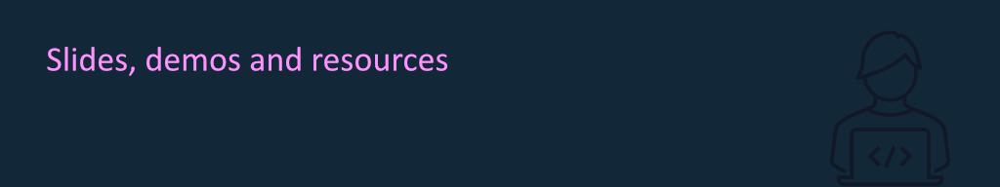

## 🧑‍💻 About this repository

This is where I publish the public resources for my talks and workshops, such as slides, sample code, and other resources. This repository contains materials from 2022 onwards - contact me if you need older stuff.

## ⌚ Recently added

- [Microsoft 365 tenant setup & configuration. Been there, done that?](m365-tenantconfig/README.md)
- [Making sense of Microsoft 365 Guest & External Access](m365-guest-ext/README.md)
- [Managing Microsoft 365 through the command-line](m365-cmdline/README.md)
- [Microsoft 365 Infrastructure-as-Code](m365-infrastructure-as-code/README.md)
- [A primer on using git and GitHub](git-github/README.md)
- [Monitoring Microsoft 365 security with Microsoft Sentinel](m365-sentinel/README.md)
- [Developing secure software with GitHub](devsec-github/README.md)
- [Using the Microsoft Graph for the reluctant IT Pro](msgraph-itpro/README.md)
- [Automating administrative tasks in Microsoft 365](automation-itpro/README.md)
- [Provisioning Microsoft Teams | Beyond the next-next-finish](teamsprov-itpro/README.md)
## 📅 Upcoming talks

For an overview of all previous and upcoming talks, see [my website](https://thomasvochten.com/speaking).

## 📧 Contact me

If you have any questions or remarks, feel free to contact me on [BlueSky](https://bsky.app/profile/thomasvochten.com) or [LinkedIn](https://www.linkedin.com/in/thomasvochten/).
