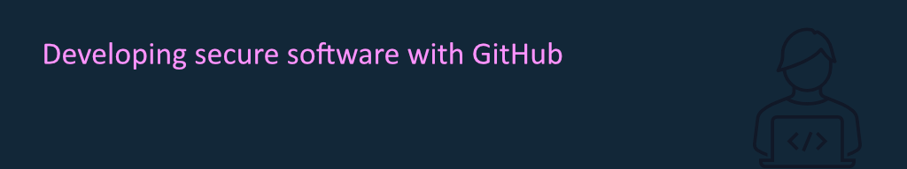

## Abstract

DevSecOps! Shift left and fail fast! - It is going to take much more than some buzzword bingo to establish a truly secure development lifecycle. In this session we demonstrate how to use GitHub Actions to make your code more secure and of higher quality, by running static application security tests (SAST) whenever you commit your code. But did you also consider the security posture of the repository that is hosting it? We will also look at the steps you can take to prevent harmful behavior from affecting your precious source code and how GitHub can help you with that.

This session is co-presented with [Laura Kokkarinen](https://laurakokkarinen.com/).

## Slides

[Download the slides here](devsec-github.pdf)

## Events

This talk has been presented at the following events:

- [European Collaboration Summit 2023](https://collabsummit.eu/), May 22-24, Düsseldorf (Germany)
- [CollabDays Finland 2023](https://www.collabdays.org/2023-finland/), September 9, Helsinki (Finland)
- [ESPC 2023](https://www.sharepointeurope.com/), November 27-30, Amsterdam (Netherlands)
