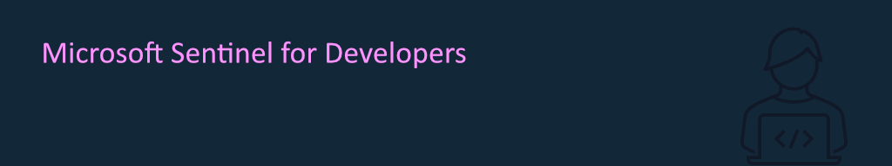

## Abstract

In this session, we explore Microsoft Sentinel's robust features and how developers can use them to improve the security posture of their applications. First, you will receive a thorough introduction to Microsoft Sentinel, its main functionalities, and requirements. Then, we will demonstrate ways to send security-related events from your application to Sentinel, followed by how you can use the service to detect and act upon potential threats. This session is designed to provide developers with the knowledge and tools to proactively monitor, detect, and mitigate security risks, thus strengthening their applications against cyber threats.

This session is co-presented with [Laura Kokkarinen](https://laurakokkarinen.com).

## Slides

[Download the slides here](sentinel4devs.pdf)

## Events

This talk has been presented at the following events:

- [European AI & Cloud Summit 2025](https://cloudsummit.eu/), May 26-28, Düsseldorf (Germany)
